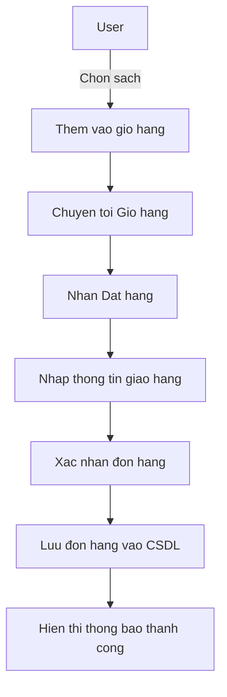
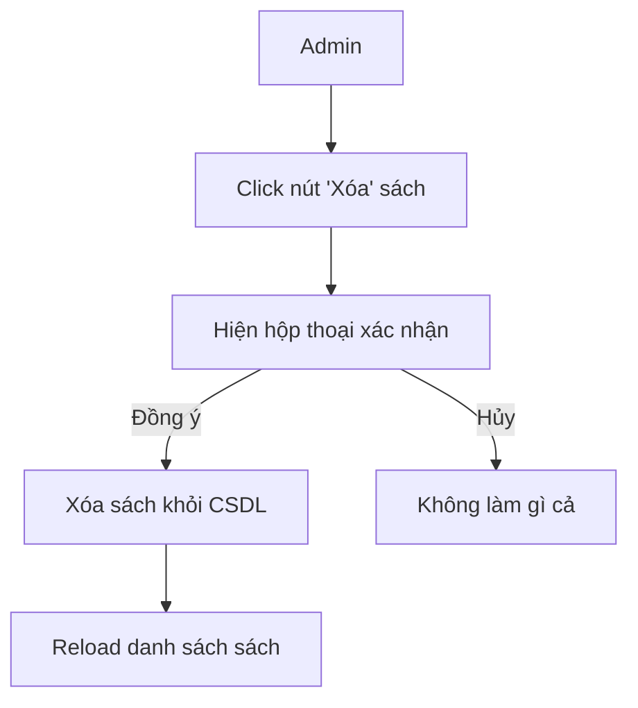
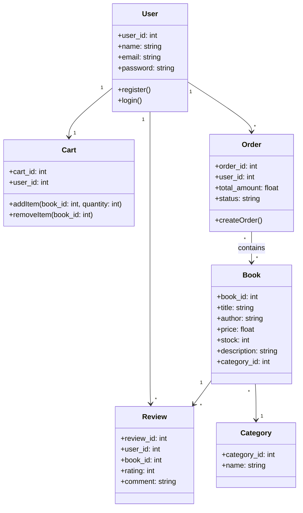

<h1>About me </h1>
<ul>
    <a href = '' ><li>Bùi Thị Hồng Tươi </li></a>
    <a href = '' ><li>Mã số sinh viên: 23015124</li></a>
    <a href = '' ><li>Thiết kế web nâng cao-1-3-24.TH3</li></a>
</ul>

I'm from PHENIKAA UNIVERSITY

# Tên dự án : Shop bán sách

# Mô tả dự án:
    -Là một trang web bán sách trực tuyến được xây dựng bằng Laravel.
    -Người dùng có thể đăng ký, đăng nhập, xem danh sách sách, tìm kiếm, thêm vào giỏ hàng và   đặt hàng.
    -Quản trị viên (Admin) có thể quản lý sách, danh mục, người dùng và đơn hàng.
    -Hệthống sử dụng các models chính như: User, Book, Cart, Order, Review, Category.
    -Hướng tới thiết kế MVC rõ ràng, dễ mở rộng trong tương lai.
    
# CHỨC năng chính:
 ✔️ Đăng ký, xác thực email, đăng nhập, đặt lại mặt khẩu
 ✔️ Quản lý danh mục sách (Thêm/Sửa/Xóa) 
 ✔️ Tìm kiếm và lọc sách theo tiêu đề, tác giả 
 ✔️ Hệ thống giỏ hàng và thanh toán trực tuyến 
 ✔️ Quản lý tài khoản người dùng và đơn hàng 
 ✔️ Giao diện thân thiện, responsive với Bootstrap
 ✔️ Quản lý khách hàng, hóa đơn

# Ngôn ngữ sử dụng:
 HTML, CSS, JavaScript, PHP, Bootstrap, MySQL,.....
 
# Cấu trúc thư mục:
admin: Chứa các tệp PHP liên quan đến phần quản trị trang web.
css: Chứa các tệp CSS để định dạng giao diện trang web.
images: Chứa các hình ảnh được sử dụng trong trang web.
js: Chứa các tệp JavaScript để thêm tính năng tương tác.
uploaded_img: Chứa các hình ảnh sản phẩm được tải lên.
Các tệp PHP

# Cơ sở dữ liệu:

 
 
## Sơ đồ chức năng (Use case diagram):

## Activity Diagram (Ví dụ: Đặt hàng - Place Order):

## Activity Diagram (Ví dụ: Xoá sách - Admin)

## Class Diagram 

## Sơ đồ thuật toán

## Link Readme (.io)

https://hongtuoi0208.github.io/shop-ban-sach/

## Link Repo

https://github.com/hongtuoi0208/shop-ban-sach

