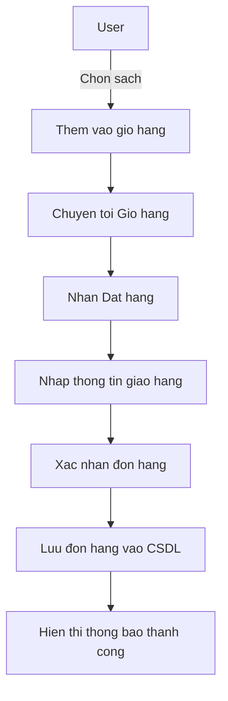
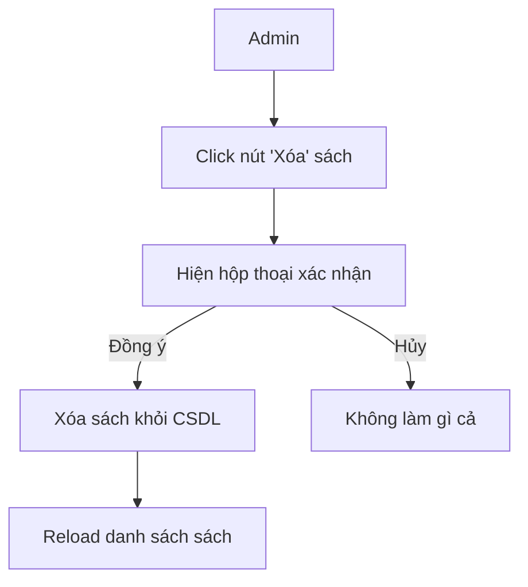
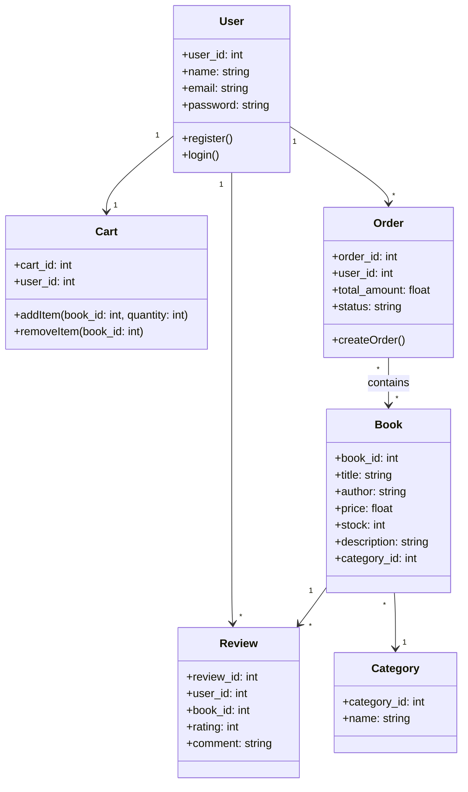

<h1>About me </h1>
<ul>
    <a href = '' ><li>Bùi Thị Hồng Tươi </li></a>
    <a href = '' ><li>Mã số sinh viên: 23015124</li></a>
    <a href = '' ><li>Thiết kế web nâng cao-1-3-24.TH3</li></a>
</ul>

I'm from PHENIKAA UNIVERSITY

# Tên dự án : Shop bán sách

# Mô tả dự án:
    -Là một trang web bán sách trực tuyến được xây dựng bằng Laravel.
    -Người dùng có thể đăng ký, đăng nhập, xem danh sách sách, tìm kiếm, thêm vào giỏ hàng và   đặt hàng.
    -Quản trị viên (Admin) có thể quản lý sách, danh mục, người dùng và đơn hàng.
    -Hệthống sử dụng các models chính như: User, Book, Cart, Order, Review, Category.
    -Hướng tới thiết kế MVC rõ ràng, dễ mở rộng trong tương lai.
    
# Chức năng chính:
 ✔️ Đăng ký, xác thực email, đăng nhập, đặt lại mặt khẩu
 ✔️ Quản lý danh mục sách (Thêm/Sửa/Xóa) 
 ✔️ Tìm kiếm và lọc sách theo tiêu đề, tác giả 
 ✔️ Hệ thống giỏ hàng và thanh toán trực tuyến 
 ✔️ Quản lý tài khoản người dùng và đơn hàng 
 ✔️ Giao diện thân thiện, responsive với Bootstrap
 ✔️ Quản lý khách hàng, hóa đơn

# Ngôn ngữ sử dụng:
 HTML, CSS, JavaScript, PHP, Bootstrap, MySQL,.....
 
# Cấu trúc thư mục:
admin: Chứa các tệp PHP liên quan đến phần quản trị trang web.
css: Chứa các tệp CSS để định dạng giao diện trang web.
images: Chứa các hình ảnh được sử dụng trong trang web.
js: Chứa các tệp JavaScript để thêm tính năng tương tác.
uploaded_img: Chứa các hình ảnh sản phẩm được tải lên.
Các tệp PHP

# Cơ sở dữ liệu:

 
 
# Sơ đồ chức năng (Use case diagram):

# Activity Diagram (Ví dụ: Đặt hàng - Place Order):

# Activity Diagram (Ví dụ: Xoá sách - Admin)

# Class Diagram 

# Sơ đồ thuật toán

# Giao diện chính của web

# Giao diện admin 

# Giao diện danh mục sách, tìm kiếm, top bán chạy

# Giao diện thanh toán

# Link Readme (.io)
https://hongtuoi0208.github.io/shop-ban-sach/

# Link Repo

https://github.com/hongtuoi0208/shop-ban-sach

## Model

<a href = '' ><li>Code Auth.Book.Controller </li></a>

<?php

namespace App\Http\Controllers;

use App\Models\Book;
use App\Models\Category;
use Illuminate\Http\Request;
use Illuminate\Support\Facades\Auth;

class BooksController extends Controller
{
    public function index(Request $request)
    {
        $query = Book::with('category');
        
        // Lọc theo danh mục
        if ($request->has('category')) {
            $category = Category::where('slug', $request->category)->first();
            if ($category) {
                $query->where('category_id', $category->id);
            }
        }
        
        // Lọc sách bán chạy
        if ($request->has('is_bestseller')) {
            $query->where('is_bestseller', true);
        }
        
        // Lọc sách mới
        if ($request->has('newest')) {
            $query->latest();
        }
        
        // Tìm kiếm
        if ($request->has('search') && $request->search) {
            $search = $request->search;
            $query->where(function($q) use ($search) {
                $q->where('title', 'like', "%{$search}%")
                  ->orWhere('description', 'like', "%{$search}%");
            });
        }
        
        // Phân trang kết quả
        $books = $query->paginate(12);
        
        // Đánh dấu sách đã yêu thích nếu người dùng đã đăng nhập
        if (Auth::check()) {
            $favoriteBookIds = Auth::user()->favorites()->pluck('book_id')->toArray();
            
            foreach ($books as $book) {
                $book->is_favorited = in_array($book->id, $favoriteBookIds);
            }
        }
        
        // Lấy tất cả danh mục
        $categories = Category::withCount('books')->get();
        
        return view('client.pages.books.index', compact('books', 'categories'));
    }
    
    public function show($slug)
    {
        $book = Book::where('slug', $slug)->firstOrFail();
        
        // Đánh dấu nếu sách đã được yêu thích
        if (Auth::check()) {
            $book->is_favorited = Auth::user()->favorites()->where('book_id', $book->id)->exists();
        }
        
        $relatedBooks = Book::where('category_id', $book->category_id)
                           ->where('id', '!=', $book->id)
                           ->take(4)
                           ->get();
        
        // Đánh dấu sách liên quan đã yêu thích
        if (Auth::check()) {
            $favoriteBookIds = Auth::user()->favorites()->pluck('book_id')->toArray();
            
            foreach ($relatedBooks as $relatedBook) {
                $relatedBook->is_favorited = in_array($relatedBook->id, $favoriteBookIds);
            }
        }
        
        return view('client.pages.books.show', compact('book', 'relatedBooks'));
    }
}

<a href = '' ><li> Code Admin.BookController </li></a>

return view('admin.pages.books.edit', compact('book', 'categories'));
    }
    
    public function update(Request $request, Book $book)
    {
        $request->validate([
            'title' => 'required|string|max:255',
            'description' => 'required|string',
            'cover_image' => 'nullable|image|mimes:jpeg,png,jpg,gif|max:2048',
            'price' => 'required|numeric|min:0',
            'stock' => 'required|integer|min:0',
            'category_id' => 'required|exists:categories,id',
        ], [
            'title.required' => 'Tên sách là bắt buộc.',
            'title.max' => 'Tên sách không được vượt quá 255 ký tự.',
            'description.required' => 'Mô tả sách là bắt buộc.',
            'cover_image.required' => 'Ảnh bìa là bắt buộc.',
            'cover_image.image' => 'Ảnh bìa phải là một hình ảnh.',
            'cover_image.mimes' => 'Ảnh bìa phải có định dạng jpeg, png, jpg hoặc gif.',

            'price.required' => 'Giá sách là bắt buộc.',
            'price.numeric' => 'Giá sách phải là một số.',
            'price.min' => 'Giá sách phải lớn hơn hoặc bằng 0.',
            'stock.required' => 'Số lượng tồn kho là bắt buộc.',
            'stock.integer' => 'Số lượng tồn kho phải là một số nguyên.',
            'stock.min' => 'Số lượng tồn kho phải lớn hơn hoặc bằng 0.',
            'category_id.required' => 'Vui lòng chọn một danh mục cho sách.',
            'category_id.exists' => 'Danh mục đã chọn không hợp lệ.',
        ]);
        
        $data = [
            'title' => $request->title,
            'slug' => Str::slug($request->title) . '-' . Str::random(5),
            'description' => $request->description,
            'price' => $request->price,
            'stock' => $request->stock,
            'is_bestseller' => $request->has('is_bestseller') ? true : false,
            'category_id' => $request->category_id,
        ];
        
        if ($request->hasFile('cover_image')) {
            if ($book->cover_image) {
                Storage::disk('public')->delete($book->cover_image);
            }
            
            $imagePath = $request->file('cover_image')->store('covers', 'public');
            $data['cover_image'] = $imagePath;
        }
        
        $book->update($data);
        
        return redirect()->route('admin.books.index')->with('success', 'Cập nhật sách thành công');
    }
    
    public function destroy(Book $book)
    {
        if ($book->cover_image) {
            Storage::disk('public')->delete($book->cover_image);
        }
        
        $book->delete();
        
        return redirect()->route('admin.books.index')->with('success', 'Xóa sách thành công');
    }
}

<a href = '' ><li> Code Model user </li></a>

<?php

namespace App\Models;

// use Illuminate\Contracts\Auth\MustVerifyEmail;
use Illuminate\Database\Eloquent\Factories\HasFactory;
use Illuminate\Foundation\Auth\User as Authenticatable;
use Illuminate\Notifications\Notifiable;

class User extends Authenticatable
{
    /** @use HasFactory<\Database\Factories\UserFactory> */
    use HasFactory, Notifiable;

    /**
     * The attributes that are mass assignable.
     *
     * @var list<string>
     */
    protected $fillable = [
        'name',
        'avatar',
        'email',
        'role',
        'password',
    ];

    // Check if user is admin
    public function isAdmin()
    {
        return $this->role === 'admin';
    }

    // Relationships
    public function favorites()
    {
        return $this->belongsToMany(Book::class, 'favorites');
    }

    public function carts()
    {
        return $this->hasMany(Cart::class);
    }

    public function orders()
    {
        return $this->hasMany(Order::class);
    }

    public function reviews()
    {
        return $this->hasMany(Review::class);
    }

    /**
     * The attributes that should be hidden for serialization.
     *
     * @var list<string>
     */
    protected $hidden = [
        'password',
        'remember_token',
    ];

    /**
     * Get the attributes that should be cast.
     *
     * @return array<string, string>
     */
    protected function casts(): array
    {
        return [
            'email_verified_at' => 'datetime',
            'password' => 'hashed',
        ];
    }
}

