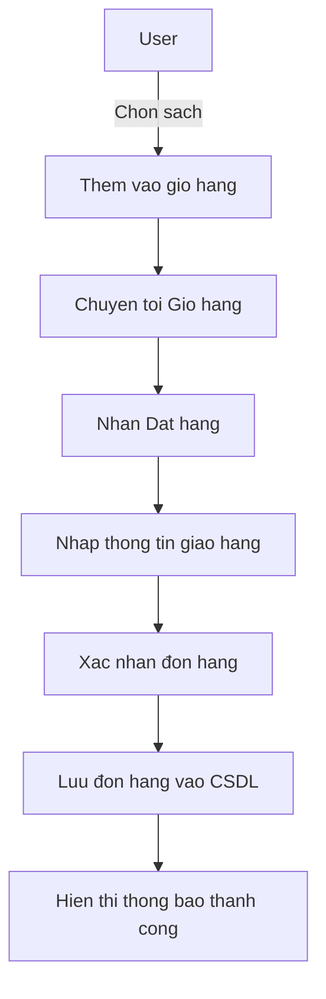
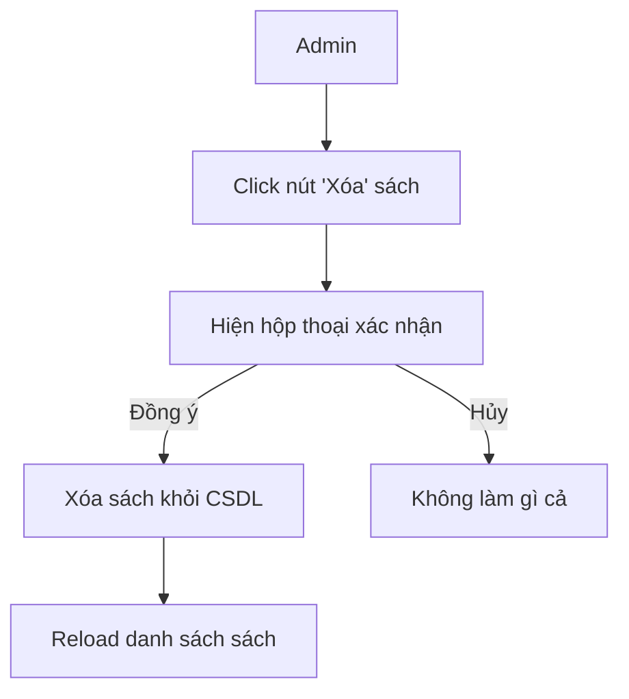
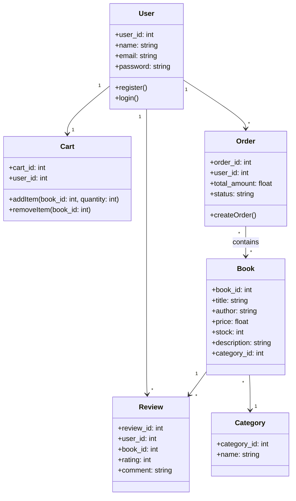

<h1>About me </h1>
<ul>
    <a href = '' ><li>Bùi Thị Hồng Tươi </li></a>
    <a href = '' ><li>Mã số sinh viên: 23015124</li></a>
    <a href = '' ><li>Thiết kế web nâng cao-1-3-24.TH3</li></a>
</ul>

I'm from PHENIKAA UNIVERSITY

# Shop-Ban-Sach-Laravel

# Sinh viên thực hiện
- **Họ và tên :** Bùi Thị Hồng Tươi
- **Mã số sinh viên :** 23015124
- **Lớp:** Thiết kế web nâng cao-1-3-24(TH3)

# Tên dự án : Shop bán sách

# Mô tả dự án
    -Là một trang web bán sách trực tuyến được xây dựng bằng Laravel.
    -Người dùng có thể đăng ký, đăng nhập, xem danh sách sách, tìm kiếm, thêm vào giỏ hàng và        đặt hàng.
    -Quản trị viên (Admin) có thể quản lý sách, danh mục, người dùng và đơn hàng.
    -Hệthống sử dụng các models chính như: User, Book, Cart, Order, Review, Category.
    -Hướng tới thiết kế MVC rõ ràng, dễ mở rộng trong tương lai.
    
# CHỨC NĂNG chính:
 ✔️ Đăng ký, xác thực email, đăng nhập, đặt lại mặt khẩu
 ✔️ Quản lý danh mục sách (Thêm/Sửa/Xóa) 
 ✔️ Tìm kiếm và lọc sách theo tiêu đề, tác giả 
 ✔️ Hệ thống giỏ hàng và thanh toán trực tuyến 
 ✔️ Quản lý tài khoản người dùng và đơn hàng 
 ✔️ Giao diện thân thiện, responsive với Bootstrap
 ✔️ Quản lý khách hàng, hóa đơn

# Ngôn ngữ sử dụng:
 HTML, CSS, JavaScript, PHP, Bootstrap, MySQL,.....
 
# Cấu trúc thư mục
admin: Chứa các tệp PHP liên quan đến phần quản trị trang web.
css: Chứa các tệp CSS để định dạng giao diện trang web.
images: Chứa các hình ảnh được sử dụng trong trang web.
js: Chứa các tệp JavaScript để thêm tính năng tương tác.
uploaded_img: Chứa các hình ảnh sản phẩm được tải lên.
Các tệp PHP

# Cơ sở dữ liệu

# Dữ liệu mẫu

| Bảng             | Số lượng record mẫu |
| ---------------- | ------------------- |
| user             | 5                   |
| product          | 100                 |
| product_review   | 150                 |
| category         | 15                  |
| product_category | 100                 |
| cart             | 2                   |
| cart_item        | 5                   |
| orders           | 25                  |
| order_item       | 60                  |
| wishlist_item    | 30                  |

# Sơ đồ liên quan

# Sơ đồ class diagram

# Sơ đồ lớp UML

# Database Diagram

## Activity Diagram (Ví dụ: Đặt hàng - Place Order)

## Activity Diagram (Ví dụ: Xoá sách - Admin)

## Class Diagram (Phiên bản rút gọn)

# Họ và tên: Đinh Nhật Tân
# Mã số sinh viên : 23013018
# Lớp: Thiết kế web nâng cao-1-3-24-TH4

# Tên dự án : Shop đồ chơi

# Giới thiệu về dự án:
 Website bán đồ chơi online giúp người dùng có thể xem, tìm kiếm, đặt mua các sản phẩm như mô hình, búp bê, lego,.....Người quản lý  có thể thêm/sửa/xóa sản phẩm, quản lý đơn hàng và danh mục đồ chơi. Laravel được sử dụng để tổ chức cấu trúc MVC rõ ràng, tích hợp các chức năng như xác thực người dùng, giỏ hàng, và thanh toán.

